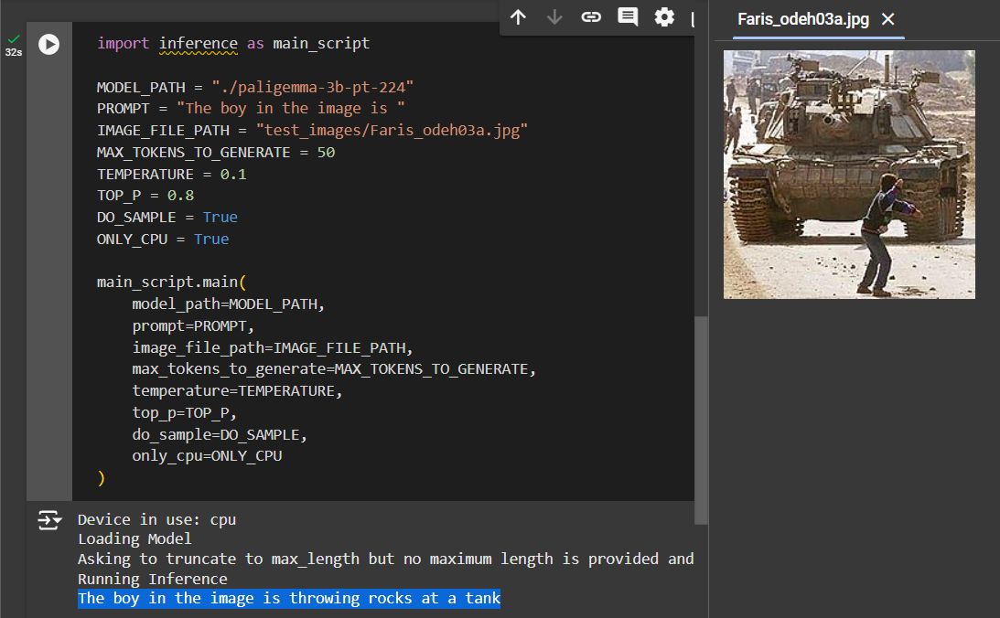

# Paligemma Tutorial

This is a practice implementation of paligemma model in PyTorch from scratch following [Coding a Multimodal (Vision) Language Model](https://youtu.be/vAmKB7iPkWw) Tutorial.  

Download model weights from [here](https://huggingface.co/google/paligemma-3b-pt-224/tree/main) before running the model.

## Results

Running `inference.py` file should run the model on a test image and give similar results as shown below:

